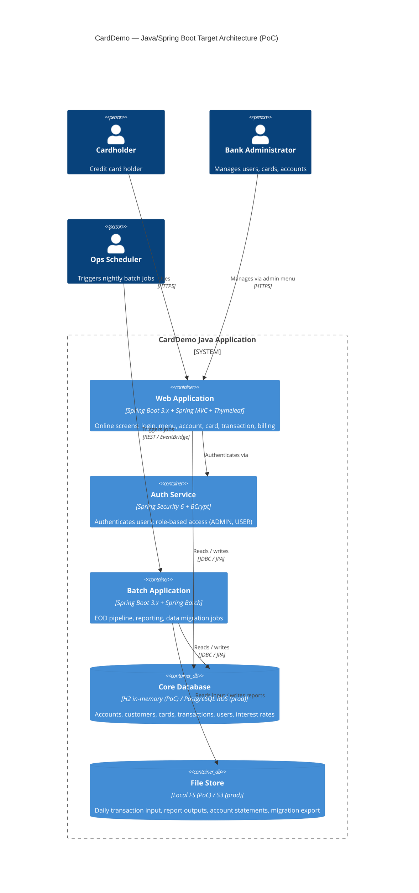
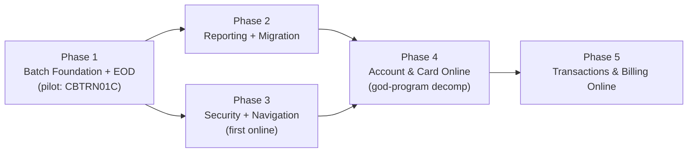

# CardDemo — Modernization Brief

**Version:** 1.0 — Initial  
**Generated:** 2026-09-13  
**Author:** `/code-modernization:modernize-brief CardDemo java-spring`

**Input timestamps (all 2026-09-13):**
| Artifact | Path |
|---|---|
| PREFLIGHT.md | `analysis/CardDemo/PREFLIGHT.md` |
| ASSESSMENT.md | `analysis/CardDemo/ASSESSMENT.md` |
| topology.json | `analysis/CardDemo/topology.json` |
| BUSINESS_RULES.md | `analysis/CardDemo/BUSINESS_RULES.md` |

> **This brief is a hypothesis.** What the pilot surfaces — a delta the analysis missed,
> a prerequisite that reorders the phases, an environment fact nobody wrote down — is
> *expected* to revise this brief. A regenerated brief after Phase 1's pilot is the normal
> path, not a correction. Reviewers steer execution by editing this file. An edited entry
> criterion is honored; a note in chat is not.

---

## 1. Objective

CardDemo is a mainframe COBOL credit-card management system (33,876 LOC across 106 programs
and copybooks) built on IBM Enterprise COBOL v6.3, CICS/BMS online screens, VSAM key-sequenced
data stores, and z/OS JES2 batch. The goal is an **exploratory proof-of-concept** — not a
production cut-over — that demonstrates the COBOL business logic can be correctly expressed in
Java, establishing that the modernization approach is sound before any production investment is
committed. The target is Java 21 + Spring Boot 3.x (Spring Batch for EOD processing, Spring MVC
for online screens, Spring Security for authentication, Spring Data JPA with H2 in-memory for the
PoC data tier). Three critical security findings (CVV storage, plaintext credentials, missing
authorization guards) are not bugs to fix in COBOL — they are architectural decisions that must
be **replaced**, not translated, making a clean rearchitect preferable to a line-by-line lift.
The execution command for every phase is `/modernize-transform`.

---

## 2. Target Architecture

### C4 Container Diagram — End State



### Legacy → Target Component Mapping

| Legacy Component | LOC | Target Component | Notes |
|---|---|---|---|
| **D1 — Security/Signon** | | | |
| COSGN00C | 260 | `AuthController` + Spring Security `UserDetailsService` | BCrypt replaces plaintext password (SEC-003) |
| COUSR00-03C | 1,767 | `UserManagementController` + `UserManagementService` | `@PreAuthorize("hasRole('ADMIN')")` on all methods (SEC-009) |
| USRSEC VSAM KSDS | — | `UserEntity` + `UserRepository` (JPA) | Passwords stored as BCrypt hash |
| **D2 — Navigation Shell** | | | |
| COMEN01C, COADM01C | 596 | Spring MVC URL routing + `MenuController` | Menu dispatch via `@RequestMapping`; role check in `@PreAuthorize` |
| **D3 — Account & Customer** | | | |
| COACTUPC | 4,236 | `AccountUpdateController` + `AccountUpdateService` + `AccountUpdateValidator` + `AccountRepository` + `CustomerRepository` | God-program decomposed into distinct classes; TD-01 |
| COACTVWC | 941 | `AccountViewController` + `AccountQueryService` | Read-only view; shares repositories |
| ACCTDATA + CUSTFILE VSAM | — | `AccountEntity` + `CustomerEntity` + JPA repositories | 2-file atomic update → single `@Transactional` method |
| **D4 — Credit Card** | | | |
| COCRDLIC + COCRDSLC | 2,346 | `CardListController` + `CardListService` | Scope-enforced: non-admin sees only their cards |
| COCRDUPC | 1,560 | `CardUpdateController` + `CardUpdateService` + `CardUpdateValidator` | CVV field removed (SEC-005, PCI DSS) |
| CARDDATA + CARDXREF VSAM | — | `CardEntity` + `CardXRefEntity` + JPA repositories | — |
| **D5 — Transaction (Online)** | | | |
| COTRN00-02C | 1,812 | `TransactionListController` + `TransactionAddController` + `TransactionService` | DB sequence replaces READPREV+increment (RULE-012 defect fix) |
| COBIL00C | 572 | `BillPaymentController` + `BillPaymentService` | Full-balance-only; zero-balance guard (RULE-010/011) |
| CORPT00C | 649 | `ReportTriggerController` + Spring Batch `JobLauncher` | REST endpoint replaces CICS TDQ internal reader |
| TRANSACT VSAM KSDS | — | `TransactionEntity` + `TransactionRepository` (JPA) | — |
| **D6 — Batch EOD** | | | |
| CBTRN01C | 494 | `TransactionValidationJob` (Spring Batch `Step`) | Reads daily tran flat file; writes rejects + valid ledger |
| CBTRN02C | 731 | `TransactionPostingJob` (Spring Batch `Step`) | Posts to account balance + category balances; credit limit check |
| CBACT04C | 652 | `InterestCalculationJob` (Spring Batch `Step`) | Monthly interest formula with explicit rounding decision (RULE-007) |
| DALYTRAN VSAM ESDS | — | Flat-file `FlatFileItemReader` | Sequential read; no VSAM dependency |
| DISCGRP + TCATBALF | — | `DiscountGroupRepository` + `TranCatBalanceRepository` (JPA) | — |
| **D7 — Reporting & Statements** | | | |
| CBACT01-03C, CBCUS01C | 964 | `AccountReportJob`, `CustomerReportJob` (Spring Batch) | Sequential scan + file writes |
| CBSTM03A + CBSTM03B | 1,154 | `StatementGenerationJob` (Spring Batch + `StatementFormatter`) | CBSTM03A/B extracted as single job (topology observation) |
| CBTRN03C | 649 | `TransactionReportJob` (Spring Batch) | Date-range filter from config (RULE-023) |
| **D8 — Data Migration** | | | |
| CBEXPORT | 582 | `DataExportJob` (Spring Batch) | Multi-file sequential export → structured JSON/CSV |
| CBIMPORT | 487 | `DataImportJob` (Spring Batch) | Import with proper validation (SEC-014 fix: Bean Validation) |
| **D9 — Optional Extensions** | — | Out of scope for PoC | IMS DB, MQ, auth module deferred |
| **D10 — Utilities** | | | |
| CSUTLDTC | 157 | `DateValidator` utility class | Java `LocalDate` parsing replaces custom date arithmetic |
| COBSWAIT | 41 | Removed | `Thread.sleep` where needed; no production use |

---

## 3. Phased Sequence

> **Execution command for all phases:** `/modernize-transform`
>
> Phase 1 is the pilot. It must complete and its playbook must be approved before
> any subsequent phase begins. The pilot unit for Phase 1 is **CBTRN01C**
> (transaction validation batch program) — it is the smallest batch program with
> a complete, testable I/O contract defined by its JCL.



Phases 2 and 3 are independent and can proceed in parallel once Phase 1 is complete. Phase 4 requires both Phase 2 (shared data model stable) and Phase 3 (Spring Security foundation in place).

---

### Phase 1 — Batch Foundation + EOD Pipeline

**Scope:** D6 batch programs (CBTRN01C, CBTRN02C, CBACT04C) + project scaffold (Spring Boot 3.x multi-module Maven project, JPA entities for Account/Customer/Card/Transaction, H2 test database, JUnit 5 test harness, golden-master fixture infrastructure).

**Pilot unit:** CBTRN01C (`TransactionValidationJob`) — transaction file validator: reads DALYTRAN sequential file, applies reject rules 100/101/102/103, writes accepted transactions to ledger and rejects to DALYREJS. Clear input→output contract from `jcl/CBTRN01C`. After CBTRN01C passes characterization tests, proceed to CBTRN02C and CBACT04C.

**Legacy modules:** CBTRN01C, CBTRN02C, CBACT04C; JCL: `CBTRN01C`, `POSTTRAN`, `INTCALC`

**Target services:** `carddemo-domain` (JPA entities + repositories), `carddemo-batch-eod` (Spring Batch jobs), `carddemo-common` (date utilities, validators, golden-master test support)

**Entry criteria:**
- [ ] `modernized/CardDemo/` directory created and `pom.xml` present
- [ ] Java 21 (`java --version`) and Maven (`mvn --version`) confirmed in environment
- [ ] Sample data fixtures in `modernized/CardDemo/src/test/resources/fixtures/` derived from `legacy/CardDemo/app/data/`
- [ ] `BASELINE.md` written: COBOL expected outputs for CBTRN01C, CBTRN02C, CBACT04C recorded from static analysis of business rules

**Exit criteria:**
- [ ] `TransactionValidationJob`, `TransactionPostingJob`, `InterestCalculationJob` compile with `mvn compile`
- [ ] JUnit 5 characterization tests pass for all 3 jobs (`mvn test`)
- [ ] RULE-007 (interest formula) tested with rounding decision explicitly documented in code comment
- [ ] RULE-061 (atomic rollback) implemented as single `@Transactional` with exception propagation test
- [ ] RULE-065 (overlimit formula) SME question answered and implementation matches answer
- [ ] Spring Boot application starts: `mvn spring-boot:run` exits without error
- [ ] Pilot playbook written: `modernized/CardDemo/PHASE1_PLAYBOOK.md` (surprises found, decisions made, pattern for remaining batch programs)

**Relative scale:** **M** — ~1,877 COBOL LOC core + scaffold; roughly 12% of the 148-point COCOMO index, plus new project infrastructure overhead.

**Risk:** Medium
- **Risk 1:** ACCTDATA exclusive lock during CBTRN02C run — the batch holds VSAM files exclusively. In Java + H2, this is `@Transactional` with row-level locking; ensure the JPA mapping uses `SELECT … FOR UPDATE` not optimistic locking for this path, or the equivalence test will pass but production will race. **Mitigation:** annotate the item writer with `@Transactional(isolation = SERIALIZABLE)` and document in playbook.
- **Risk 2:** Interest rounding decision (RULE-007 truncates, no ROUNDED clause) — the Java rewrite must make a deliberate choice (truncate / half-up / banker's rounding). The wrong choice accumulates material error across accounts. **Mitigation:** document chosen rounding mode in `InterestCalculationService` and add a property-based test over 10,000 random balances to bound the maximum per-account divergence.

---

### Phase 2 — Reporting & Statements + Data Migration

**Scope:** D7 reporting programs (CBACT01-03C, CBCUS01C, CBSTM03A+B, CBTRN03C) and D8 migration programs (CBEXPORT, CBIMPORT).

**Legacy modules:** CBACT01C, CBACT02C, CBACT03C, CBCUS01C, CBSTM03A, CBSTM03B, CBTRN03C, CBEXPORT, CBIMPORT

**Pilot unit:** CBSTM03A + CBSTM03B (statement generation) — the two programs must be migrated together as a single `StatementGenerationJob` (topology observation: CBSTM03A calls CBSTM03B 13× per account).

**Target services:** `carddemo-batch-reporting` (reporting jobs), `carddemo-batch-migration` (export/import jobs)

**Entry criteria:**
- [ ] Phase 1 exit criteria fully met and playbook approved
- [ ] `PHASE1_PLAYBOOK.md` contains the entity model and repository conventions for D7/D8 to follow

**Exit criteria:**
- [ ] All 7 reporting/statement programs have Spring Batch equivalents compiling and tested
- [ ] `DataExportJob` produces a structured output (JSON or CSV) that `DataImportJob` can re-ingest
- [ ] `DataImportJob` implements full Bean Validation on import (SEC-014 fix): SSN format, credit-limit range, date format — with test cases for each invalid input
- [ ] RULE-021 (three-level totaling), RULE-022 (page size), RULE-023 (date-range filter) all covered by characterization tests
- [ ] Statement output (text or HTML) matches golden-master for at least 3 test accounts

**Relative scale:** **M** — ~3,836 COBOL LOC; roughly 26% of the COCOMO index. Sequential processing programs follow a uniform reader→processor→writer pattern; the payload is volume, not complexity.

**Risk:** Low-Medium
- **Risk 1:** CBSTM03A's 13-call PERFORM chain — in Java, the 13 calls to CBSTM03B become 13 invocations of `StatementFormatter.formatLine()`; mistaking this for a batch of 13 items (not 13 lines per account) would produce a wrong output size. **Mitigation:** add an assertion in the characterization test that verifies statement line count per account.
- **Risk 2:** DALYREJS reject handling gap (documentation gap DG-5 in ASSESSMENT) — no documentation states whether rejects are resubmitted, discarded, or manually reviewed. **Mitigation:** flag as open question (§7); default implementation writes rejects to a structured reject log; SME must confirm disposition before Phase 2 exits.

---

### Phase 3 — Authentication & Navigation (First Online)

**Scope:** D1 security programs (COSGN00C, COUSR00-03C, USRSEC VSAM) and D2 navigation shell (COMEN01C, COADM01C). This phase also delivers the CICS adaptation layer: `CicsAid` enum (replaces `DFHAID`), `BmsAttr` enum (replaces `DFHBMSCA`), `CicsContext` value object (replaces COMMAREA / EIB fields).

**Legacy modules:** COSGN00C, COUSR00C, COUSR01C, COUSR02C, COUSR03C, COMEN01C, COADM01C

**Pilot unit:** COSGN00C → `AuthController` — the sign-on flow is the gateway to every other online screen and is the simplest CICS program (260 LOC, pure authentication logic). A passing integration test for COSGN00C that exercises RULE-001 through RULE-006 proves the Spring Security wiring is correct before any domain screen is attempted.

**Target services:** `carddemo-web` module with sub-packages: `auth` (AuthController, UserDetailsServiceImpl), `admin` (UserManagementController), `navigation` (MenuController), `common` (CicsAid, BmsAttr, CicsContext, CicsSession)

**Entry criteria:**
- [ ] Phase 1 exit criteria met
- [ ] Spring Boot `carddemo-web` module skeleton created with Spring Security 6 dependency
- [ ] `UserEntity` and `UserRepository` from Phase 1 domain module confirmed compatible with `UserDetailsService` contract

**Exit criteria:**
- [ ] `AuthController` integration test covers RULE-001 through RULE-006 (6 P0 auth rules) — blank user, blank password, unknown user, wrong password, admin routing, regular-user routing
- [ ] Passwords stored as BCrypt hash; RULE-004 (plain-text comparison) replaced with `passwordEncoder.matches()`; SEC-003 fixed
- [ ] `UserManagementController` annotated with `@PreAuthorize("hasRole('ADMIN')")` on all endpoints; SEC-009 fixed
- [ ] RULE-055 (session lifecycle) implemented as Spring Security `HttpSession` with session-invalidation on logout
- [ ] Menu navigation produces correct URL routing for all 11 menu options; option 11 (auth extension, D9) returns HTTP 503 with a message instead of abending
- [ ] Spring Boot application starts with security configured and login page accessible at `/`
- [ ] At this point, P7 success criteria 2 ("at least 1 CICS program expressed as Spring MVC controller") is met

**Relative scale:** **M** — ~2,623 COBOL LOC; roughly 18% of the COCOMO index. The security model is simple (2 roles, 1 VSAM file). The CICS adaptation layer adds non-trivial new design work with no direct COBOL equivalent.

**Risk:** Medium
- **Risk 1:** COMMAREA session-state design — the COBOL COMMAREA (`COCOM01Y`) is a shared mutable struct passed across every CICS XCTL. Spring Security's `SecurityContext` replaces the authentication fields, but domain state carried in COMMAREA (current account ID, screen context) needs a clean Java model. Designing this wrong forces rework in Phases 4 and 5. **Mitigation:** design `CicsContext` as an immutable value object in Phase 3 and test it in Phase 3 before any domain screen uses it.
- **Risk 2:** SEC-009 missing admin authorization — `COUSR01C/02C/03C` currently have no authorization check (the COBOL bug). The Java implementation must add `@PreAuthorize` before these endpoints exist in the wild; test that a non-admin JWT/session cannot reach user-management URLs. **Mitigation:** write a Spring Security `@WithMockUser(roles="USER")` negative test for each user-management endpoint in Phase 3.

---

### Phase 4 — Account & Customer + Credit Card Online (God-Program Decomposition)

**Scope:** D3 online account programs (COACTUPC, COACTVWC) and D4 credit-card programs (COCRDLIC, COCRDSLC, COCRDUPC). This phase contains the highest single-program complexity in the system: COACTUPC (4,236 LOC, CCN 122, TD-01).

**Legacy modules:** COACTUPC, COACTVWC, COCRDLIC, COCRDSLC, COCRDUPC

**Pilot unit:** COACTVWC (941 LOC, read-only account view) — the simplest D3 program. It exercises the complete ACCTDATA + CUSTFILE read path but has no write logic, no validation, and no state machine. Passing COACTVWC's characterization test proves the `AccountQueryService` and entity model are correct before COACTUPC (the god-program) is attempted.

**COACTUPC decomposition plan (must be followed in this order):**
1. Extract `ScreenRenderer` (presentation only — BMS map population logic)
2. Extract `AccountUpdateValidator` (all 8 field-type validators: SSN, phone, FICO, state/zip cross-field, etc.)
3. Extract `AccountRepository.save(account, customer)` as one `@Transactional` method (RULE-061 fix — TD-07)
4. Extract `PhoneValidator.validate()` as early-return logic (TD-09 — GO TO spaghetti)
5. Only after steps 1–4, write `AccountUpdateController` using the extracted components

**Target services:** `carddemo-web` additions: `account` package (`AccountUpdateController`, `AccountViewController`, `AccountUpdateService`, `AccountUpdateValidator`, `AccountQueryService`), `card` package (`CardListController`, `CardDetailController`, `CardUpdateController`, `CardUpdateService`, `CardUpdateValidator`)

**Entry criteria:**
- [ ] Phase 3 exit criteria met (Spring Security + `CicsContext` fully wired)
- [ ] COACTUPC decomposition plan above approved by engineering lead
- [ ] RULE-065 (overlimit formula) SME question resolved (carried from Phase 1 open questions)
- [ ] RULE-059 (inactive account batch posting) SME question resolved

**Exit criteria:**
- [ ] `AccountViewController` characterization test covers read-only display of account + customer fields
- [ ] `AccountUpdateController` integration tests cover: all P1 validation rules (RULE-024 through RULE-045), RULE-053 (optimistic locking — concurrent-update scenario), RULE-061 (atomic rollback — second file write failure path)
- [ ] `CARD-CVV-CD` field absent from `CardEntity`, `CardUpdateController`, and all API responses (SEC-005 / PCI DSS fix)
- [ ] RULE-053 concurrency test: two simultaneous requests to update the same account; second writer receives HTTP 409 (not a silent lost update)
- [ ] `CODING-TO-BE-DONE` sentinel (TD-10) in COACTUPC, COCRDUPC, COACTVWC, COCRDSLC documented as known functionality gap in `PHASE4_GAPS.md`; SME review scheduled before Phase 4 exits

**Relative scale:** **XL** — ~9,083 COBOL LOC; roughly 61% of the COCOMO index concentrated in this phase. COACTUPC alone (CCN 122) represents more design effort than all batch phases combined. Do not underestimate.

**Risk:** High
- **Risk 1:** COACTUPC GO TO spaghetti (TD-09) — phone/SSN validation uses paragraph fall-through plus 51 GO TO statements. Translating paragraph-by-paragraph without recognizing the fall-through nominal path silently omits validation for the common case. **Mitigation:** trace the nominal path through all four sub-paragraphs in the characterization test before writing any Java; add a property-based test that fuzzes valid phone numbers and expects acceptance.
- **Risk 2:** `CODING-TO-BE-DONE` incomplete functionality (TD-10) — four programs contain an unresolved sentinel indicating missing requirements. If SME cannot identify the missing requirements before Phase 4 exits, the Java implementation will reproduce the same gap and the exit criteria cannot be met. **Mitigation:** treat unresolved `CODING-TO-BE-DONE` items as a Phase 4 hard blocker; do not mark Phase 4 complete if the SME question is unanswered.

---

### Phase 5 — Transactions & Billing Online

**Scope:** D5 transaction programs (COTRN00C, COTRN01C, COTRN02C, COBIL00C, CORPT00C).

**Legacy modules:** COTRN00C, COTRN01C, COTRN02C, COBIL00C, CORPT00C

**Pilot unit:** COBIL00C → `BillPaymentController` — the simplest write-path CICS program (572 LOC), with a completely known data contract (RULE-010/011) and a single TRANSACT write. It proves the `@Transactional` write path through JPA before the more complex `TransactionAddController` is attempted.

**Target services:** `carddemo-web` additions: `transaction` package (`TransactionListController`, `TransactionDetailController`, `TransactionAddController`, `TransactionService`), `billing` package (`BillPaymentController`, `BillPaymentService`), `report` package (`ReportTriggerController`)

**Entry criteria:**
- [ ] Phase 4 exit criteria met
- [ ] `TransactionRepository` and `TransactionEntity` from Phase 1 confirmed stable
- [ ] `JobLauncher` bean available in `carddemo-web` context for `ReportTriggerController`
- [ ] CORPT00C TDQ content (documentation gap DG-2) resolved: the JCL skeleton content assembled at runtime must be known before `ReportTriggerController` can be written

**Exit criteria:**
- [ ] `BillPaymentController` tests cover RULE-010 (full-balance payment), RULE-011 (zero-balance block), RULE-012 fix (DB sequence replaces READPREV+increment)
- [ ] `TransactionAddController` tests cover RULE-047 through RULE-054 (all transaction validation rules)
- [ ] RULE-012 defect fixed: transaction ID generation uses a `SEQUENCE` DDL object (H2) or `GenerationType.SEQUENCE` (JPA) — concurrent duplicate IDs are structurally impossible
- [ ] RULE-051 (Y confirmation required) implemented as a two-step form flow with CSRF protection
- [ ] `ReportTriggerController` fires a Spring Batch job asynchronously and returns HTTP 202 Accepted with a job-execution ID
- [ ] All P7 success criteria met: ≥3 batch programs tested, ≥1 CICS controller tested, Spring Boot starts, no business logic in controllers or batch steps

**Relative scale:** **L** — ~3,033 COBOL LOC; roughly 20% of the COCOMO index. Well-structured programs by D5 standards; the main work is the transaction ID fix and the report trigger re-architecture.

**Risk:** Medium
- **Risk 1:** CORPT00C TDQ content unknown (DG-2) — the JCL skeleton assembled at runtime is not documented anywhere in the source. If the SME cannot reconstruct it, `ReportTriggerController` cannot be written correctly. **Mitigation:** flag as Phase 5 blocker in §7; default to a configurable JCL template property if SME is unavailable.
- **Risk 2:** RULE-054 (date error code 2513 silently suppressed) — current COBOL deliberately or accidentally accepts a specific invalid date. If Java's `LocalDate` throws on that same date, the behaviors diverge. **Mitigation:** characterize which dates trigger code 2513 using the CSUTLDTC source before implementing `DateValidator`; reproduce the suppression behavior in Java if SME confirms it is intentional.

---

## 4. Business Walkthroughs

| # | Persona | What happens (business language) | Legacy modules | Phase |
|---|---|---|---|---|
| **1** | Credit card holder | Signs on with their user ID and password. The system validates credentials against the user file, determines their role (admin or regular), and routes them to the correct menu. | COSGN00C, USRSEC VSAM, COMEN01C | Phase 3 |
| | | Navigates to Account View to see their current balance, credit limit, and customer details. | COACTVWC, ACCTDATA, CUSTFILE | Phase 4 |
| | | Navigates to Transaction History to review recent activity, then drills into a specific transaction for full detail. | COTRN00C, COTRN01C, TRANSACT | Phase 5 |
| **2** | Bank administrator | Signs on with admin credentials and is routed to the admin menu (not the regular user menu). | COSGN00C, COADM01C | Phase 3 |
| | | Navigates to the card list, locates a customer's card by account ID, opens the card detail, updates the embossed name and expiry date, and saves. The system enforces that the card existed before the update (optimistic locking — if someone else saved first, the update is rejected with a fresh read). | COCRDLIC, COCRDSLC, COCRDUPC, CARDDATA, CARDXREF | Phase 4 |
| **3** | Ops scheduler (CA7 / Control-M) | At end of day, triggers the nightly batch chain. The system validates each record in the daily transaction file (checking that each card and account exists and the account is within its credit limit) and writes rejects to the reject log. | CBTRN01C, DALYTRAN | Phase 1 |
| | | Posts all valid transactions to their accounts, updating the running balance, cycle accumulators, and per-category balances (which feed interest calculation). | CBTRN02C, ACCTDATA, TCATBALF, TRANSACT | Phase 1 |
| | | Recalculates monthly interest for every account by applying each category's annual rate (÷ 1200) to its accumulated balance, then writes the interest charge as a transaction. Resets cycle accumulators to zero. | CBACT04C, DISCGRP, TCATBALF, ACCTDATA | Phase 1 |
| | | Generates account statements (text and HTML) for every customer and produces the transaction category report filtered to the billing period. | CBSTM03A, CBSTM03B, CBTRN03C | Phase 2 |
| **4** | Credit card holder | Signs on, navigates to the billing screen. Sees their current balance displayed. Confirms payment with 'Y'. The system posts a full-balance payment transaction (type '02', merchant 'BILL PAYMENT') and sets the account balance to zero. A zero-balance account cannot initiate a payment. | COBIL00C, ACCTDATA, TRANSACT | Phase 5 |

---

## 5. Behavior Contract

The following P0 rules **must be proven equivalent before any phase ships.** These form the regression suite. Each rule cited maps directly to a test requirement for the phase that implements it.

| Rule | Name | Phase | Confidence | Blocker? |
|---|---|---|---|---|
| RULE-001 | User ID must not be blank | Phase 3 | High | No |
| RULE-002 | Password must not be blank | Phase 3 | High | No |
| RULE-003 | User must exist in USRSEC | Phase 3 | High | No |
| RULE-004 | Password match (Java: BCrypt replaces plaintext) | Phase 3 | High | No |
| RULE-005 | User type routing: admin → admin menu | Phase 3 | High | No |
| RULE-006 | Regular user blocked from admin-only options | Phase 3 | High | No |
| RULE-007 | Monthly interest formula (rounding decision required) | Phase 1 | High | No — but rounding choice must be documented and SME-approved |
| RULE-008 | Account balance updated after interest run | Phase 1 | High | No |
| RULE-009 | Cycle credit/debit accumulators reset after interest | Phase 1 | High | No |
| RULE-010 | Bill payment = full current balance | Phase 5 | High | No |
| RULE-011 | Zero-balance payment blocked | Phase 5 | High | No |
| RULE-012 | Transaction ID — fix: DB sequence, not READPREV+increment | Phase 5 | High | No |
| RULE-013 | Julian-day expiry arithmetic (D9 — out of scope for PoC) | — | High | N/A (D9 deferred) |
| RULE-014 | Expired auth count/amount decremented (D9 — out of scope) | — | High | N/A |
| RULE-015 | Auth summary deletion — **CONFIRMED DEFECT** (D9 — out of scope) | — | High | N/A |
| RULE-053 | Optimistic locking: concurrent update prevention | Phase 4 | High | No |
| RULE-055 | User session lifecycle | Phase 3 | High | No |
| RULE-059 | Account active-status domain (Y/N) | Phase 4 | High | **Yes — SME must confirm whether 'N' blocks batch posting before Phase 1 exits** |
| RULE-060 | Card active-status domain (Y/N) | Phase 4 | High | No |
| RULE-061 | Atomic rollback on two-file account update | Phase 4 | High | No |
| RULE-063 | Batch: card must exist in XREF (reject 100) | Phase 1 | High | No |
| RULE-064 | Batch: account must exist in ACCTDAT (reject 101) | Phase 1 | High | No |
| RULE-065 | Batch: credit limit enforcement (reject 102) | Phase 1 | High | **Yes — SME must confirm overlimit formula uses cycle-to-date only (not running balance) before Phase 1 exits** |
| RULE-066 | Batch: account not expired (reject 103) | Phase 1 | Medium (format assumption) | **Yes — SME must confirm ACCT-EXPIRAION-DATE and DALYTRAN-ORIG-TS are always YYYY-MM-DD before Phase 1 exits** |
| RULE-068 | Category balance accumulation (feeds interest) | Phase 1 | High | No |
| RULE-069 | Account balance updated per posted transaction | Phase 1 | High | No |

**Blockers requiring SME confirmation before their phase starts:**
- **RULE-059** (P0): Does inactive account status 'N' block batch transaction posting? CBTRN02C does not check this — is that a bug or a policy? Blocks Phase 1 exit.
- **RULE-065** (P0): Overlimit check uses only cycle-to-date amounts, not carry-forward balance. Is this correct credit policy? Blocks Phase 1 exit.
- **RULE-066** (P0, Confidence Medium): Are ACCT-EXPIRAION-DATE and DALYTRAN-ORIG-TS always in YYYY-MM-DD format? A format mismatch silently produces wrong expiry comparisons. Blocks Phase 1 exit.

---

## 6. Validation Strategy

| Phase | Strategy | Justification |
|---|---|---|
| Phase 1 (Batch EOD) | **Golden-master characterization tests** using fixtures derived from `legacy/CardDemo/app/data/` sample data. Property-based tests for interest formula (RULE-007) over 10,000 random balances. No dual execution possible (no z/OS runtime). | Batch programs have clear input→output contracts from JCL; golden-master is the only equivalence approach available without a live mainframe (Premise P3). |
| Phase 2 (Reporting) | **Golden-master characterization tests** for statement output (text and HTML). File-diff comparison for report outputs. | Sequential processing programs produce deterministic file outputs. |
| Phase 3 (Security/Navigation) | **Spring Security integration tests** with `@WithMockUser` for role-based access. HTTP-layer tests for login flows (RULE-001 through RULE-006). | Security rules are fully specified; integration testing via MockMvc is sufficient without a browser. |
| Phase 4 (Account/Card) | **Spring MVC integration tests** for all 45 validation rules (RULE-024 through RULE-053). **Concurrency tests** for RULE-053 (two simultaneous updates; one must get 409). | The god-program decomposition requires testing each extracted component independently before wiring them together; the concurrency rule requires a multi-thread integration test. |
| Phase 5 (Transactions/Billing) | **Spring MVC integration tests** for all D5 validation rules (RULE-047 through RULE-054). **DB sequence test** for RULE-012: concurrent transaction adds must not produce duplicate IDs. | Transaction add has the most validation surface in D5; the ID generation fix requires a specific concurrency assertion. |
| All phases | **Manual UAT walkthrough** of the 4 flows in §4 after Phase 5, against a seeded H2 database. | Verifies that individually-correct components compose into coherent user journeys. |

---

## 7. Open Questions

The following questions require human or SME decision before Phase 1 can start or exit. Each is a hard gate.

**Before Phase 1 starts:**
- [ ] **Q1 (Phase 1 entry):** Has the sample data in `legacy/CardDemo/app/data/` been verified as valid COBOL-format input for CBTRN01C? The golden-master fixture depends on this data being representative.
- [ ] **Q2 (Phase 1 entry):** What is the intended rounding mode for the interest formula (RULE-007)? The COBOL truncates toward zero (no ROUNDED clause). Options: preserve truncation (maximize bank revenue), half-up (standard consumer), banker's rounding (minimize systemic bias). This is a business policy decision.

**Before Phase 1 exits:**
- [ ] **Q3 (Phase 1 exit — RULE-059 blocker):** Does account active-status 'N' block batch transaction posting? CBTRN02C does not check this field. SME must decide whether the Java implementation should add this check.
- [ ] **Q4 (Phase 1 exit — RULE-065 blocker):** The overlimit check in CBTRN02C uses only cycle-to-date amounts (ACCT-CURR-CYC-CREDIT − ACCT-CURR-CYC-DEBIT + new transaction), ignoring carry-forward balances from prior cycles. Is this the intended credit policy?
- [ ] **Q5 (Phase 1 exit — RULE-066 blocker):** Confirm that both ACCT-EXPIRAION-DATE and DALYTRAN-ORIG-TS are always stored in YYYY-MM-DD format. A mismatch produces silent wrong expiry comparisons.

**Before Phase 2 exits:**
- [ ] **Q6 (Phase 2 exit):** What is the intended disposition of DALYREJS reject records (documentation gap DG-5)? Are they: (a) manually reviewed and resubmitted, (b) automatically reprocessed next day, or (c) permanently discarded?

**Before Phase 4 starts:**
- [ ] **Q7 (Phase 4 entry):** What are the missing requirements behind the `CODING-TO-BE-DONE VALUE 'Looks Good.... so far'` sentinel in COACTUPC, COCRDUPC, COACTVWC, and COCRDSLC (TD-10)? These represent unknown functionality gaps in the 4 core read/write flows.
- [ ] **Q8 (Phase 4 entry):** Should the online card update screen reject expiry dates already in the past (RULE-029 gap)? Currently the COBOL accepts past expiry dates online; the batch enforces expiry at posting time.
- [ ] **Q9 (Phase 4 entry):** Card expiry day is frozen at its original value even when month/year changes (RULE-030). If the original day was 31 and the month is changed to a 30-day month, an invalid date is stored. Is the freeze intentional? Should day be re-validated against the new month?

**Before Phase 5 starts:**
- [ ] **Q10 (Phase 5 entry):** What JCL skeleton content does CORPT00C assemble and write to the CICS JOBS TDQ (documentation gap DG-2)? Without this, `ReportTriggerController` cannot be implemented correctly.
- [ ] **Q11 (Phase 5 entry):** What is CSUTLDTC error code 2513, and is its suppression in transaction date validation (RULE-054) intentional? Possible explanations: leap-year ambiguity, timezone warning, or accidental suppression. If intentional, Java's `LocalDate` must reproduce the same behavior.

---

## 8. Approval Block

```
Approved by: ________________  Date: __________

Approval covers (circle one):   Phase 1 only  |  Full plan

Notes:
___________________________________________________________________
___________________________________________________________________
```

> **Approval scope:** Phase 1 approval authorizes `/modernize-transform` to begin on
> CBTRN01C only. Full-plan approval authorizes the complete 5-phase sequence.
> Approvers may edit any phase's entry or exit criteria in this document before
> signing — edits here are binding; notes in a separate channel are not.
> Phase 1's pilot playbook (`PHASE1_PLAYBOOK.md`) is expected to revise this brief
> before Phase 2 begins; that revision requires a separate approval.
